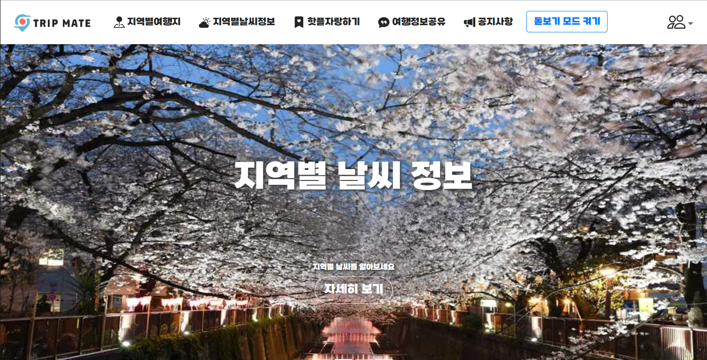
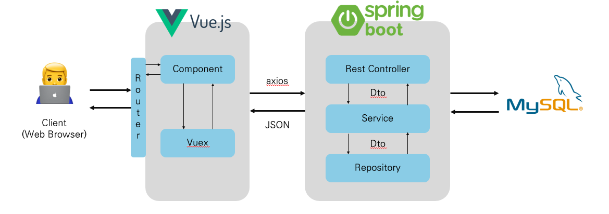

# TripMate

* 2023.05.18 ~ 2023.05.25(1주)
* 엔데믹 상황에서의 여행 수요 증가로 관광지 추천 프로젝트 기획
* 지도 기반 여행지 추천 및 지역별 관광지 검색, 날씨 정보 제공 서비스
* 돋보기 모드를 통한 웹 접근성 고려

## 역할

| 이름 | Part | Detail |
| :---: | :---: | :---: |
| 최규헌 | FE & BE & PM | api 구현 및 페이지 구현 & 일정, 형상 관리 |
| 안유진 | FE & BE | api 구현 및 페이지 구현 | 

## 기술 스택

### Front
* VUE.js

### Back
* Spring Boot
* MyBatis
* MySQL

## 서비스 소개

 

[전체 기능 유튜브 시연 영상](https://www.youtube.com/watch?v=dXFn7_I_KJE)

## 아키텍처

## Directory
* [SpringBoot](./backend/)
* [Vue.js](./frontend/)
* [DB schema](./schema/)
* [PPT & Diagrams](./Docs/)